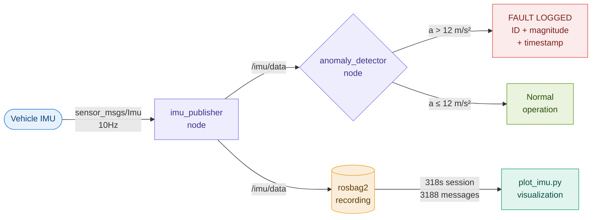

<div align="center">


### Real-time IMU Sensor Fault Detection for Autonomous Vehicles

<br>


<br>

> A two-node ROS2 pipeline that streams live IMU data, detects mechanical faults in real time,
> and records rosbag artifacts for post-session analysis —
> the same workflow used by AV test engineers validating
> perception and control systems on public roads.

</div>

---

## Live output


> **300 samples captured live at 10Hz.**
> Blue line = continuous acceleration magnitude stream.
> Orange dashed line = fault threshold at 12 m/s².
> Red spikes = anomalies detected and flagged in real time.
> Baseline ~9.8 m/s² represents normal gravitational acceleration.

---

## How it works



---

## Pipeline at a glance

```
╔══════════════════════════════════════════════════════════════════════════╗
║                    ROS2 IMU ANOMALY DETECTION PIPELINE                   ║
╠══════════════════════════════════════════════════════════════════════════╣
║                                                                          ║
║   ┌──────────────────┐    /imu/data     ┌──────────────────────────┐    ║
║   │  imu_publisher   │ ─────────────►  │    anomaly_detector      │    ║
║   │                  │    10Hz stream   │                          │    ║
║   │  • Imu @ 10Hz    │                  │  |a| = √(ax²+ay²+az²)   │    ║
║   │  • ~2% fault     │                  │  threshold  = 12 m/s²   │    ║
║   │    injection     │                  │  latency    < 100 ms    │    ║
║   │  • 15–20 m/s²    │                  │  logs: ID + magnitude   │    ║
║   │    spike range   │                  │                          │    ║
║   └──────────────────┘                  └──────────────────────────┘    ║
║            │                                          │                  ║
║            └──────────────┬───────────────────────────┘                  ║
║                           ▼                                              ║
║                  ┌─────────────────┐                                     ║
║                  │    rosbag2      │                                     ║
║                  │  3,188 messages │                                     ║
║                  │  318s duration  │                                     ║
║                  │  sqlite3 store  │                                     ║
║                  └────────┬────────┘                                     ║
║                           ▼                                              ║
║                  ┌─────────────────┐                                     ║
║                  │  plot_imu.py    │                                     ║
║                  │  matplotlib PNG │                                     ║
║                  └─────────────────┘                                     ║
╚══════════════════════════════════════════════════════════════════════════╝
```

---

## Results

<div align="center">

| Metric | Value |
|:------:|:-----:|
| Publish rate | **10 Hz** |
| Messages recorded | **3,188** |
| Recording duration | **318 seconds** |
| Fault detection latency | **< 100 ms** |
| Anomaly threshold | **12 m/s²** |
| Fault injection rate | **~2% of samples** |

</div>

---

## Stack

```
┌─────────────────────────────────────────────────────────┐
│                      TECH STACK                         │
├───────────────────────┬─────────────────────────────────┤
│  Robotics framework   │  ROS2 Humble                    │
│  Language             │  Python 3, rclpy                │
│  Message types        │  sensor_msgs/Imu, std_msgs      │
│  Data recording       │  rosbag2 (sqlite3 backend)      │
│  Visualization        │  matplotlib, numpy              │
│  Environment          │  Docker (osrf/ros:humble)       │
│  Build system         │  colcon, ament_python           │
└───────────────────────┴─────────────────────────────────┘
```

---

## Project structure

```
ros2-imu-anomaly-monitor/
│
├── imu_monitor/
│   ├── __init__.py
│   ├── imu_publisher.py          ◄── 10Hz IMU publisher + fault injection
│   └── anomaly_detector.py       ◄── real-time threshold fault detector
│
├── launch/
│   └── imu_monitor.launch.py     ◄── launches both nodes together
│
├── plot_imu.py                   ◄── 300-sample live visualizer → PNG
├── imu_plot.png                  ◄── sample output (shown above)
├── package.xml
└── setup.py
```

---

## Quickstart

**Step 1 — Pull ROS2 Humble**
```bash
docker pull osrf/ros:humble-desktop
```

**Step 2 — Run with workspace mounted**
```bash
docker run -it --rm \
  -v $(pwd):/ros2_ws \
  osrf/ros:humble-desktop bash
```

**Step 3 — Build and launch**
```bash
source /opt/ros/humble/setup.bash
cd /ros2_ws
colcon build --packages-select imu_monitor
source install/setup.bash
ros2 launch imu_monitor imu_monitor.launch.py
```

**Step 4 — Record a rosbag session** *(second terminal)*
```bash
ros2 bag record -o imu_session /imu/data
ros2 bag info imu_session
```
```
Files:             imu_session_0.db3
Bag size:          1.2 MiB
Duration:          318.708s
Messages:          3188
Topic: /imu/data | Type: sensor_msgs/msg/Imu | Count: 3188
```

**Step 5 — Generate visualization** *(third terminal)*
```bash
python3 plot_imu.py
# collecting 300 samples...
# plot saved to /ros2_ws/imu_plot.png
```

---

## Sample terminal output

```
[imu_publisher-1]    [INFO]: IMU Publisher started
[anomaly_detector-2] [INFO]: Anomaly Detector started
[imu_publisher-1]    [WARN]: Anomalous reading injected!
[anomaly_detector-2] [ERROR]: ANOMALY #1 detected! |a| = 15.74 m/s²
[imu_publisher-1]    [WARN]: Anomalous reading injected!
[anomaly_detector-2] [ERROR]: ANOMALY #2 detected! |a| = 18.39 m/s²
[imu_publisher-1]    [WARN]: Anomalous reading injected!
[anomaly_detector-2] [ERROR]: ANOMALY #3 detected! |a| = 18.57 m/s²
[anomaly_detector-2] [ERROR]: ANOMALY #4 detected! |a| = 19.59 m/s²
```

---

## Why this matters for AV testing

```
╔═══════════════════════════════╦═══════════════════════════════════╗
║   AV Test Engineering Skill   ║        This Project               ║
╠═══════════════════════════════╬═══════════════════════════════════╣
║  Sensor stream validation     ║  /imu/data topic @ 10Hz           ║
║  Real-time fault detection    ║  anomaly_detector node            ║
║  Data recording for replay    ║  rosbag2 session recording        ║
║  Multi-node orchestration     ║  custom launch file               ║
║  Post-session analysis        ║  matplotlib visualization         ║
║  Linux + ROS2 environment     ║  Docker, colcon, ament_python     ║
╚═══════════════════════════════╩═══════════════════════════════════╝
```

---

## Related projects

- [AI-Driven MLOps Pipeline](https://github.com/poojithamadhyala) — production ML pipeline with drift monitoring and automated retraining alerts
- [Pothole Detection AI](https://github.com/poojithamadhyala) — YOLOv8 object detector running at 41ms CPU latency on edge hardware
- [Real-Time Anomaly Detection](https://github.com/poojithamadhyala) — Isolation Forest on live joint-torque sensor streams with WebSocket dashboard

---

<div align="center">

Built by [Poojitha Madhyala](https://linkedin.com/in/poojitha-madhyala-038980323)

MS Robotics & AI · Arizona State University · May 2026

[LinkedIn](https://linkedin.com/in/poojitha-madhyala-038980323) · [GitHub](https://github.com/poojithamadhyala) · [Portfolio](https://poojithamadhyala.github.io)

</div>
