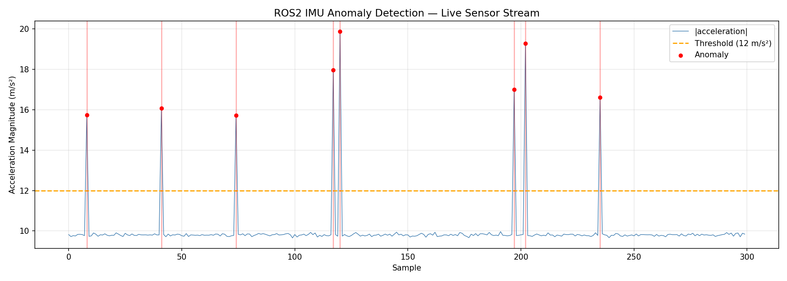

<div align="center">


# ROS2 IMU Anomaly Monitor

**Real-time sensor fault detection on live IMU streams**

*Built to mirror autonomous vehicle test engineering workflows*

</div>

---


*300 samples @ 10Hz — red markers show faults detected above the 12 m/s² threshold in real time*

---

## What this does

A two-node ROS2 pipeline that publishes simulated IMU data, detects acceleration anomalies the moment they occur, records rosbag artifacts for post-session analysis, and generates a visualization of the sensor stream. This mirrors what AV test engineers do when validating perception and control systems on public roads.

---

## Pipeline

```
┌─────────────────────────┐         ┌──────────────────────────┐
│      imu_publisher      │         │     anomaly_detector     │
│  ─────────────────────  │         │  ──────────────────────  │
│  Publishes Imu @ 10Hz   │──────►  │  |a| = √(ax²+ay²+az²)   │
│  Injects fault spikes   │         │  Flags if |a| > 12 m/s²  │
│  (~2% rate, 15-20 m/s²) │         │  Logs fault ID + value   │
└─────────────────────────┘         └──────────────────────────┘
           │                                      │
           └────────── /imu/data (10Hz) ──────────┘
                             │
                      ┌──────────────┐
                      │   rosbag2    │
                      │  3,188 msgs  │
                      │   318 secs   │
                      └──────────────┘
```

---

## Results

| Metric | Value |
|--------|-------|
| Publish rate | 10 Hz |
| Messages recorded | 3,188 |
| Recording duration | 318 seconds |
| Fault detection latency | < 100 ms |
| Anomaly threshold | 12 m/s² |
| Fault injection rate | ~2% of samples |

---

## Stack

| Layer | Technology |
|-------|-----------|
| Robotics framework | ROS2 Humble |
| Language | Python 3, rclpy |
| Message types | sensor_msgs/Imu |
| Data recording | rosbag2 (sqlite3) |
| Visualization | matplotlib |
| Environment | Docker |
| Build system | colcon, ament_python |

---

## Project structure

```
ros2-imu-anomaly-monitor/
├── imu_monitor/
│   ├── imu_publisher.py          # 10Hz IMU publisher with fault injection
│   └── anomaly_detector.py       # Real-time threshold-based fault detector
├── launch/
│   └── imu_monitor.launch.py     # Launches both nodes together
├── plot_imu.py                   # Collects 300 samples, saves imu_plot.png
├── imu_plot.png                  # Sample output visualization
└── package.xml
```

---

## Quickstart

**1. Pull ROS2 Humble**
```bash
docker pull osrf/ros:humble-desktop
```

**2. Run with workspace mounted**
```bash
docker run -it --rm \
  -v $(pwd):/ros2_ws \
  osrf/ros:humble-desktop bash
```

**3. Build and launch**
```bash
source /opt/ros/humble/setup.bash
cd /ros2_ws
colcon build --packages-select imu_monitor
source install/setup.bash
ros2 launch imu_monitor imu_monitor.launch.py
```

**4. Record a rosbag session**
```bash
ros2 bag record -o imu_session /imu/data
ros2 bag info imu_session
# Topic: /imu/data | Type: sensor_msgs/msg/Imu | Count: 3188 | Duration: 318s
ros2 bag play imu_session
```

**5. Generate visualization**
```bash
python3 plot_imu.py
# Saves imu_plot.png — 300 samples with anomalies marked in red
```

---

## Sample terminal output

```
[imu_publisher]:    IMU Publisher started
[anomaly_detector]: Anomaly Detector started
[imu_publisher]:    Anomalous reading injected!
[anomaly_detector]: ANOMALY #1 detected! |a| = 15.74 m/s²
[imu_publisher]:    Anomalous reading injected!
[anomaly_detector]: ANOMALY #2 detected! |a| = 18.39 m/s²
[anomaly_detector]: ANOMALY #3 detected! |a| = 18.57 m/s²
```

---

## Related projects

- [AI-Driven MLOps Pipeline](https://github.com/poojithamadhyala) — production ML pipeline with drift monitoring and automated retraining
- [Pothole Detection AI](https://github.com/poojithamadhyala) — YOLOv8 object detector at 41ms CPU latency on edge hardware

---

<div align="center">
<sub>Built by <a href="https://linkedin.com/in/poojitha-madhyala-038980323">Poojitha Madhyala</a> — MS Robotics & AI, Arizona State University, May 2026</sub>
</div>
